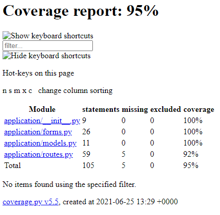

# Photography Idea Sharing

## Contents
* [Introduction](#Introduction)
    * [Solution](#Solution)
* [Design](#Design)
    * [Risk Assessment](#Risk-Assessment)
    * [Trello Board](#Trello-Board)
    * [Entity Relationship Diagram](#Entity-Relationship-Diagram)
    * [Continuous Integration](#Continuous-Integration)
* [Development](#Development)
    * [Front End](#Front-End)
    * [Test Analysis](#Test-Analysis)
* [Conclusion](#Conclusion)

---
## __Introduction__

The objective of this project is to produce a CRUD application which utilises the tools, methodologies and technology that have been covered during the prior training.

These are as follows:
* A Kanban board, involving user stories, tasks to be completed and any issues I come across during the project.
* A relational database to store data for the project, with ___at least___ 2 tables in it.
* Clear Documentation for the design phase of the application, and a  ___Risk Assessment___.
* A functional CRUD application, that meets the requirements on the Trello Board.
* Test suites that make sure the application functions correctly.
* A functioning front end-website, and integrated APIs.
* Integration with a VCS, allowing for access on a CI server for full cloud integration.

---
### __Solution__

I have decided to create a photography idea sharing platform, where users can post ideas, and look at ideas from other users to get inspiration for their hobby.

For the application to have CRUD functionality, I have planned that users will be able to:

_Create:_
* Create posts with their ideas, tagged with a variety of pre-existing tags

_Read:_
* View ideas they, and other users have posted

_Update:_
* Update ideas, such as adding a tag or changing the description

_Delete:_
* Delete ideas from the list.
---
## __Design__

### __Risk Assessment__
Here is my risk assessment, going over all the potential hazards I may face during the project, and measures I have implemented to ensure they are avoided, or the impact of the hazard is reduced or mitigated


The full risk assessment can be found through this [link](https://qalearning-my.sharepoint.com/:x:/g/personal/bdobson_qa_com/Ea7VL69js3lFsdUOYl5c-lYBWXcJKyovMulqUqg5MI5Vuw?e=A61Vvv)

---
### __Trello Board__
I decided to use Trello to track the progress of my project, having used it for previous projects I am familiar with the platform and it meets the needs of this project.


The complete board can be found [here](https://trello.com/b/Un8ul8xd)

---
### __Entity Relationship Diagram__

The initial ERD I made for the project can be seen here:


However I decided to simplify the design to meet the MVP, and then allow for iteration once the MVP was fully developed and functional, and any issues fixed. This is the new ERD for the project:


If the project had more time, I would have liked to add the user functionality, which would make the website more usable, since currently anyone can change any posts.

---
### __Continuous Integration__

I used Jenkins to implement continuous integration into the project, this allowed me to pull new changes that are pushed to my github repository via a webhook, then run a script which runs through the unit and integration tests, save the coverage report produced by the tests, and then build the application so it can be accessed. 

This allowed me to run tests on new builds I pushed to the development branch and ensure that everything worked, before pushing it into the main branch on my VCS.


I used the following script to run tests and build the application.

```
export duri skey testdburi
python3 -m venv venv
. ./venv/bin/activate
pip3 install -r requirements.txt
pytest --cov=application . --cov-report html
zip archive.zip htmlcov/index.html
gunicorn --workers=4 --bind=0.0.0.0:5000 app:app
```

What the script does

**1.** Exports secrets that are needed by the application.

**2.** Creates a virtual environment and activates it

**3.** Installs the required packages for the application to run

**4.** Runs the tests in the application and creates a file for archiving

**5.** Starts the application on 4 different worker processes.

Then, once the build is ended, the testing coverage file is archived for future analysis

---
## __Development__

### __Front End__

To make all areas of the application easily accessible, I added basic navigation to the layout.html, and made each page extend from that. This makes the application more user friendly, and easier to build on in the future, as new routes can simply extend from the layout.

#### __1. Home Page__

For the home page, I wanted to display all the tags available for use, and all the ideas that have been added to the database. This implements the ***read*** part of the CRUD application brief.


#### __2. Add Idea Page__

The add idea page uses a simple form to allow the user to enter data for the specific fields used in the table, I also included a drop-down list for the tags, making it easy to select which tag suits the idea. On successful submission, the user is redirected to the home page and can view their new entry in the list of ideas.


#### __3. Update Page__

The update page is very similar to the add page, but with a drop down for the list of ideas in the database. It also allows for fields to be empty if the information doesn't need to be updated, and keeps the old entry instead.


#### __4. Delete Page__

The delete page simply lets you select an idea from the list of ideas in the database, and removes it.


---
### __Test Analysis__

To ensure the application worked as intended, I wanted to reach a minimum of 80% test coverage, with all routes being tested to ensure they were functional.

#### __Unit Testing__
Starting with the home page I wanted to simply test if it was accessible, and that it was displaying the sample data that was added to the local test database, created at the start of the testing.

Then for the add page, I wanted to make sure it could add data provided to the database, and also that if the data given was invalid, it would instead stay on the page and give an error

Update and Delete use similar tests to make sure that once they have been used, the data that has been changed or deleted is no longer in the home page.

#### __Integration Testing__
To test how the application integrates with the SQL database, I set up a testing database on the cloud instance I used, this database will always be empty, since the testing cleans up after it is ran, therefore isn't wasting any of the cloud resources I am using.

For these tests I used Selenium, this allowed me to test the navigation, and all the input fields, by using the xpath of the elements on the application.

#### __Running Tests and Output__

The tests in the application are ran automatically each time a new build is started, as part of the Jenkins script I mentioned earlier, it then also outputs a html report for the coverage of the testing as an artefact, which can be downloaded and viewed on a browser.



---
## __Conclusion__

In conclusion, I think the application meets the requirements set by the project brief, and I managed to include some extra features, such as the navigation for the different routes.

I used the Trello board effectively, to keep track of the progress of the project, this meant that I was aware of what tasks still needed to be completed to produce the MVP, as well as decide on some features to not include in the project, and to meet the deadline of the project.

My designs changed throughout development, to meet the MVP requirements, and in the future if I wanted to improve the project, the old designs could be referenced for new features that could be added.

The functionality of the application meets the requirements, however some notable areas for improvement are:

* Error messages when the validation fails
* Instead of listing tags on the home page, just have the name with the idea
* User Login functionality

I am also happy with the test coverage I was able to achieve for the application, and how I managed to implement the CI server, to pull new builds, test them automatically, and create a live environment.

In the future, I would like to adapt to the Test-Driven Development style, as this will help me work towards a functional MVP even faster, and reduce further iteration which will help save time in development of future applications.

---
__Author:__ Bradley Dobson
---
