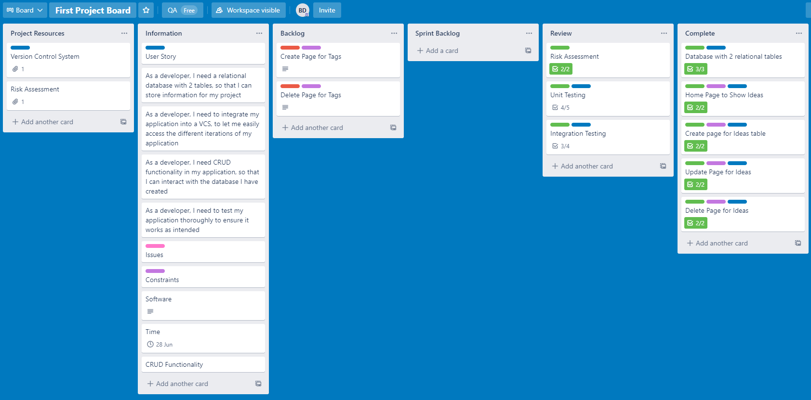

# Photography Idea Sharing

## Contents
* [Introduction](#Introduction)
    * [Solution](#Solution)
* [Design](#Design)
    * [Risk Assessment](#Risk-Assessment)
    * [Trello Board](#Trello-Board)
    * [Entity Relationship Diagram](#Entity-Relationship-Diagram)
    * [Continuous Integration](#Continuous-Integration)
* [Development](#Development)
    * [Front End](#Front-End)
    * [Integration Testing](#Integration-Testing)
* [Conclusion](#Conclusion)

## __Introduction__

The objective of this project is to produce a CRUD application which utilises the tools, methodologies and technology that have been covered during the prior training.

These are as follows:
* A Kanban board, involving user stories, tasks to be completed and any issues I come across during the project.
* A relational database to store data for the project, with ___at least___ 2 tables in it.
* Clear Documentation for the design phase of the application, and a  ___Risk Assessment___.
* A functional CRUD application, that meets the requirements on the Trello Board.
* Test suites that make sure the application functions correctly.
* A functioning front end-website, and integrated APIs.
* Integration with a VCS, allowing for access on a CI server for full cloud integration.

### __Solution__

I have decided to create a photography idea sharing platform, where users can post ideas, and look at ideas from other users to get inspiration for their hobby.

For the application to have CRUD functionality, I have planned that users will be able to:

_Create:_
* Create posts with their ideas, tagged with a variety of pre-existing tags

_Read:_
* View ideas they, and other users have posted

_Update:_
* Update ideas, such as adding a tag or changing the description

_Delete:_
* Delete ideas from the list.

## __Design__

### __Risk Assessment__
Here is my risk assessment, going over all the potential hazards I may face during the project, and measures I have implemented to ensure they are avoided, or the impact of the hazard is reduced or mitigated

The full risk assessment can be found through this [link](https://qalearning-my.sharepoint.com/:x:/g/personal/bdobson_qa_com/Ea7VL69js3lFsdUOYl5c-lYBWXcJKyovMulqUqg5MI5Vuw?e=A61Vvv)

### __Trello Board__
I decided to use Trello to track the progress of my project, having used it for previous projects I am familiar with the platform and it meets the needs of this project.

The complete board can be found [here](https://trello.com/b/Un8ul8xd)

### __Entity Relationship Diagram__

The initial ERD I made for the project can be seen here:

However I decided to simplify the design to meet the MVP, and then allow for iteration once the MVP was fully developed and functional, and any issues fixed. This is the new ERD for the project:

### __Continuous Integration__

I used Jenkins to implement continuous integration into the project, this allowed me to pull new changes that are pushed to my github repository via a webhook, then run a script which runs through the unit and integration tests, save the coverage report produced by the tests, and then build the application so it can be accessed. 

This allowed me to run tests on new builds I pushed to the development branch and ensure that everything worked, before pushing it into the main branch on my VCS.

## __Development__

### __Front End__

### __Test Analysis__

### __Integration Testing__

## __Conclusion__

__Author:__ Bradley Dobson
